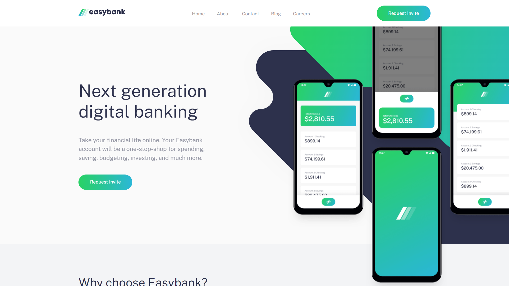

# Frontend Mentor - Easybank landing page solution

This is a solution to the [Easybank landing page challenge on Frontend Mentor](https://www.frontendmentor.io/challenges/easybank-landing-page-WaUhkoDN). Frontend Mentor challenges help you improve your coding skills by building realistic projects.

## Table of contents

- [Overview](#overview)
  - [The challenge](#the-challenge)
  - [Screenshot](#screenshot)
  - [Links](#links)
- [My process](#my-process)
  - [Built with](#built-with)
  - [What I learned](#what-i-learned)
- [Author](#author)
- [Acknowledgments](#acknowledgments)

**Note: Delete this note and update the table of contents based on what sections you keep.**

## Overview

### The challenge

Users should be able to:

- View the optimal layout for the site depending on their device's screen size
- See hover states for all interactive elements on the page

### Screenshot

### Links

- Solution URL: [https://github.com/1Hanif1/Frontend-Projects/tree/main/I-easybank-landing-page](https://github.com/1Hanif1/Frontend-Projects/tree/main/I-easybank-landing-page)
- Live Site URL: [https://1hanif1.github.io/Frontend-Projects/I-easybank-landing-page/](https://1hanif1.github.io/Frontend-Projects/I-easybank-landing-page/)

## My process

### Built with

- Semantic HTML5 markup
- Sass variables
- Flexbox
- CSS Grid
- Mobile-first workflow
- Intersection Observer API

### What I learned

I used mobile-first workflow and really liked it. I could build future projects using the same workflow now.

## Author

- Website - [Hanif Barbhuiya](https://bio.link/hanifmb)
- Frontend Mentor - [@1Hanif1](https://www.frontendmentor.io/profile/1Hanif1)
- Twitter - [@HMohammedB\_](https://twitter.com/HMohammedB_)

## Acknowledgments

I built this project alongside Jessica's videos on youtube a.k.a [Coder Coder](https://www.youtube.com/playlist?list=PLUWqFDiirlsuYscECzks6zIZWr_Cfcx9k)
