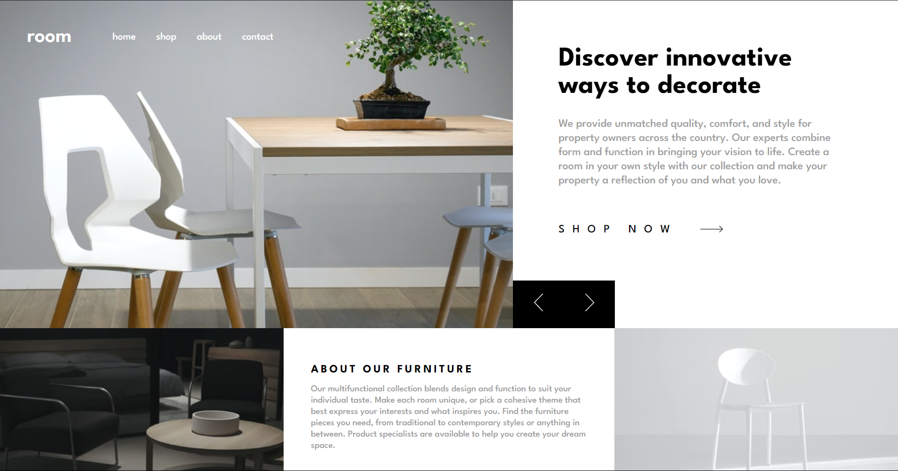

# Frontend Mentor - Room homepage solution

This is a solution to the [Room homepage challenge on Frontend Mentor](https://www.frontendmentor.io/challenges/room-homepage-BtdBY_ENq). Frontend Mentor challenges help you improve your coding skills by building realistic projects.

## Table of contents

- [Overview](#overview)
  - [The challenge](#the-challenge)
  - [Screenshot](#screenshot)
  - [Links](#links)
- [My process](#my-process)
  - [Built with](#built-with)
  - [Continued development](#continued-development)

## Overview

### The challenge

Users should be able to:

- View the optimal layout for the site depending on their device's screen size
- See hover states for all interactive elements on the page
- Navigate the slider using either their mouse/trackpad or keyboard

### Screenshot

### Links

- Solution URL: [https://github.com/1Hanif1/Frontend-Projects/tree/main/I-room-homepage](https://github.com/1Hanif1/Frontend-Projects/tree/main/I-room-homepage)

- Live Site URL: [https://1hanif1.github.io/Frontend-Projects/I-room-homepage](https://1hanif1.github.io/Frontend-Projects/I-room-homepage)

## My process

### Built with

- Semantic HTML5 markup
- Flexbox
- CSS Grid
- [React](https://reactjs.org/) - JS library

### Continued development

I will be learning more about CSS Animations with React and adding interactivity as dealing with css and react components through classes was a bit complicated.
