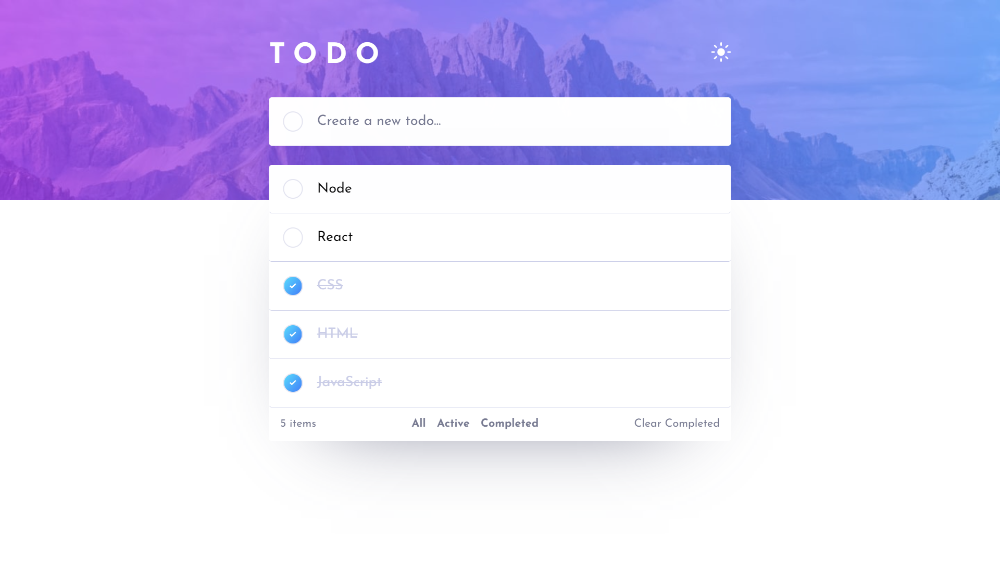
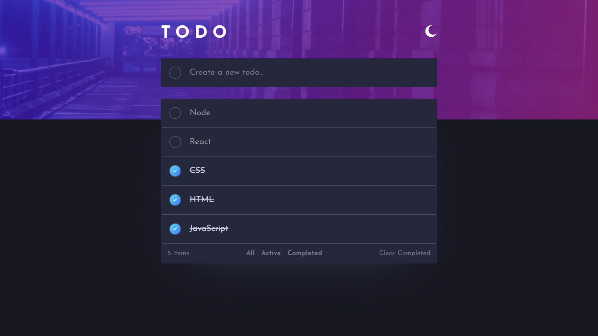

# Frontend Mentor - Todo app solution

This is a solution to the [Todo app challenge on Frontend Mentor](https://www.frontendmentor.io/challenges/todo-app-Su1_KokOW). Frontend Mentor challenges help you improve your coding skills by building realistic projects.

## Table of contents

- [Overview](#overview)
  - [The challenge](#the-challenge)
  - [Screenshot](#screenshot)
  - [Links](#links)
- [My process](#my-process)
  - [Built with](#built-with)
  - [What I learned](#what-i-learned)
- [Author](#author)

## Overview

### The challenge

Users should be able to:

- View the optimal layout for the app depending on their device's screen size
- See hover states for all interactive elements on the page
- Add new todos to the list
- Mark todos as complete
- Delete todos from the list
- Filter by all/active/complete todos
- Clear all completed todos
- Toggle light and dark mode
- **Bonus**: Drag and drop to reorder items on the list

### Screenshot

- Light Mode

- Dark Mode

### Links

- Solution URL: [https://github.com/1Hanif1/Frontend-Projects/tree/main/I-todo-app](https://github.com/1Hanif1/Frontend-Projects/tree/main/I-todo-app)
- Live Site URL: [https://1hanif1.github.io/Frontend-Projects/I-todo-app/](https://1hanif1.github.io/Frontend-Projects/I-todo-app/)

## My process

### Built with

- Html
- Sass
- Flexbox
- JavaScript

### What I learned

- Creating a theme switcher
- Using local storage to store tasks
- sorting tasks
- CRUD operations

## Author

- Website - [Hanif Barbhuiya](https://bio.link/hanifmb)
- Frontend Mentor - [@1Hanif1](https://www.frontendmentor.io/profile/1Hanif1)
- Twitter - [@HMohammedB\_](https://twitter.com/HMohammedB_)
