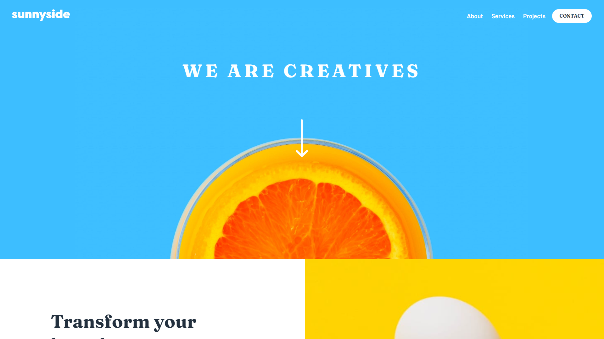

# Frontend Mentor - Sunnyside agency landing page solution

This is a solution to the [Sunnyside agency landing page challenge on Frontend Mentor](https://www.frontendmentor.io/challenges/sunnyside-agency-landing-page-7yVs3B6ef). Frontend Mentor challenges help you improve your coding skills by building realistic projects.

## Table of contents

- [Overview](#overview)
  - [The challenge](#the-challenge)
  - [Screenshot](#screenshot)
  - [Links](#links)
- [My process](#my-process)
  - [Built with](#built-with)
  - [What I learned](#what-i-learned)
- [Author](#author)

## Overview

### The challenge

Users should be able to:

- View the optimal layout for the site depending on their device's screen size
- See hover states for all interactive elements on the page

### Screenshot

### Links

- Solution URL: [https://github.com/1Hanif1/Frontend-Projects/tree/main/J-Sunny-Side-Landing-Page](https://github.com/1Hanif1/Frontend-Projects/tree/main/J-Sunny-Side-Landing-Page)
- Live Site URL: [https://1hanif1.github.io/Frontend-Projects/J-Sunny-Side-Landing-Page/](https://1hanif1.github.io/Frontend-Projects/J-Sunny-Side-Landing-Page/)

## My process

### Built with

- Semantic HTML5 markup
- CSS custom properties
- CSS Grid
- Sass
- Gulp js

### What I learned

- I used CSS Grid for layout
- Added keyframe animations
- Used intersection observer API for triggering animations
- used `clip-path: polygon()` for mobile menu
- I used gulp js to compile the sass files

## Author

- Website - [Hanif Barbhuiya](https://bio.link/hanifmb)
- Frontend Mentor - [@1Hanif1](https://www.frontendmentor.io/profile/1Hanif1)
- Twitter - [@HMohammedB\_](https://twitter.com/HMohammedB_)
