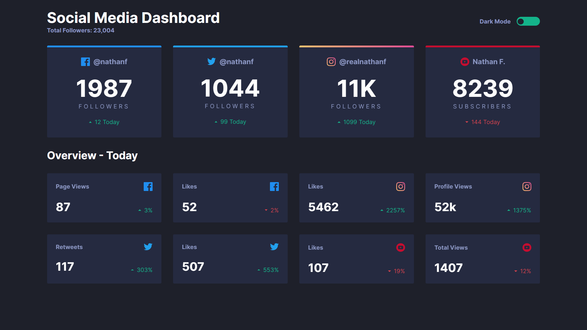
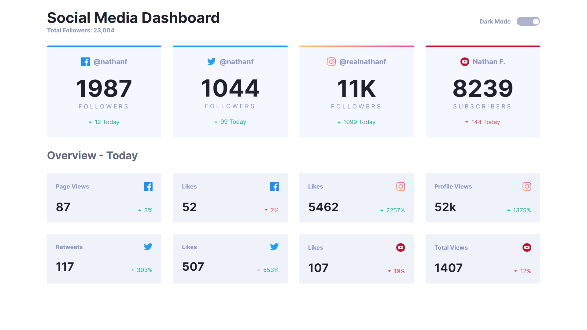

# Frontend Mentor - Social media dashboard with theme switcher solution

This is a solution to the [Social media dashboard with theme switcher challenge on Frontend Mentor](https://www.frontendmentor.io/challenges/social-media-dashboard-with-theme-switcher-6oY8ozp_H). Frontend Mentor challenges help you improve your coding skills by building realistic projects.

## Table of contents

- [Overview](#overview)
  - [The challenge](#the-challenge)
  - [Screenshot](#screenshot)
  - [Links](#links)
- [My process](#my-process)
  - [Built with](#built-with)
  - [What I learned](#what-i-learned)
- [Author](#author)

## Overview

### The challenge

Users should be able to:

- View the optimal layout for the site depending on their device's screen size
- See hover states for all interactive elements on the page
- Toggle color theme to their preference

### Screenshot

### Links

- Solution URL: [https://github.com/1Hanif1/Frontend-Projects/tree/main/J-dashboard-with-theme-switcher](https://github.com/1Hanif1/Frontend-Projects/tree/main/J-dashboard-with-theme-switcher)
- Live Site URL: [https://1hanif1.github.io/Frontend-Projects/J-dashboard-with-theme-switcher/](https://1hanif1.github.io/Frontend-Projects/J-dashboard-with-theme-switcher/)

## My process

### Built with

- Semantic HTML5 markup
- CSS Grid and Flexbox
- Sass with mixins and variables
- Javascript

### What I learned

- Creating a theme switcher using JavaScript
- I used CSS Grid for layout and flexbox
- Added keyframe animations
- Implemented a `counterTimer()` function in JS to create a counter effect on the dashboard numbers

## Author

- Website - [Hanif Barbhuiya](https://bio.link/hanifmb)
- Frontend Mentor - [@1Hanif1](https://www.frontendmentor.io/profile/1Hanif1)
- Twitter - [@HMohammedB\_](https://twitter.com/HMohammedB_)
