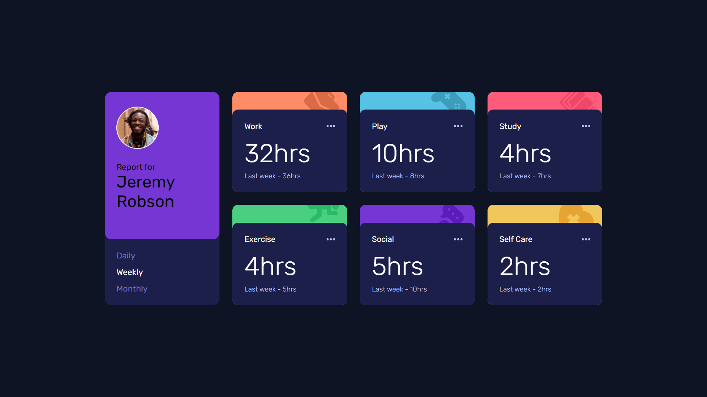

# Frontend Mentor - Time tracking dashboard solution

This is a solution to the [Time tracking dashboard challenge on Frontend Mentor](https://www.frontendmentor.io/challenges/time-tracking-dashboard-UIQ7167Jw). Frontend Mentor challenges help you improve your coding skills by building realistic projects.

## Table of contents

- [Overview](#overview)
  - [The challenge](#the-challenge)
  - [Screenshot](#screenshot)
  - [Links](#links)
- [My process](#my-process)
  - [Built with](#built-with)
  - [What I learned](#what-i-learned)
- [Author](#author)

## Overview

### The challenge

Users should be able to:

- View the optimal layout for the site depending on their device's screen size
- See hover states for all interactive elements on the page
- Switch between viewing Daily, Weekly, and Monthly stats

### Screenshot

### Links

- Solution URL: [https://github.com/1Hanif1/Frontend-Projects/tree/main/J-time-tracking-dashboard](https://github.com/1Hanif1/Frontend-Projects/tree/main/J-time-tracking-dashboard)
- Live Site URL: [https://1hanif1.github.io/Frontend-Projects/J-time-tracking-dashboard/](https://1hanif1.github.io/Frontend-Projects/J-time-tracking-dashboard/)

## My process

### Built with

- Semantic HTML5 markup
- CSS Grid
- Sass
- Sass variables
- Javascript

### What I learned

- I used CSS Grid for layout
- Added keyframe animations
- Fetched data for dashboard using `fetch()` function
- Updating UI using Javascript
- Use Sass variables
- Dividing CSS code into modules

## Author

- Website - [Hanif Barbhuiya](https://bio.link/hanifmb)
- Frontend Mentor - [@1Hanif1](https://www.frontendmentor.io/profile/1Hanif1)
- Twitter - [@HMohammedB\_](https://twitter.com/HMohammedB_)
